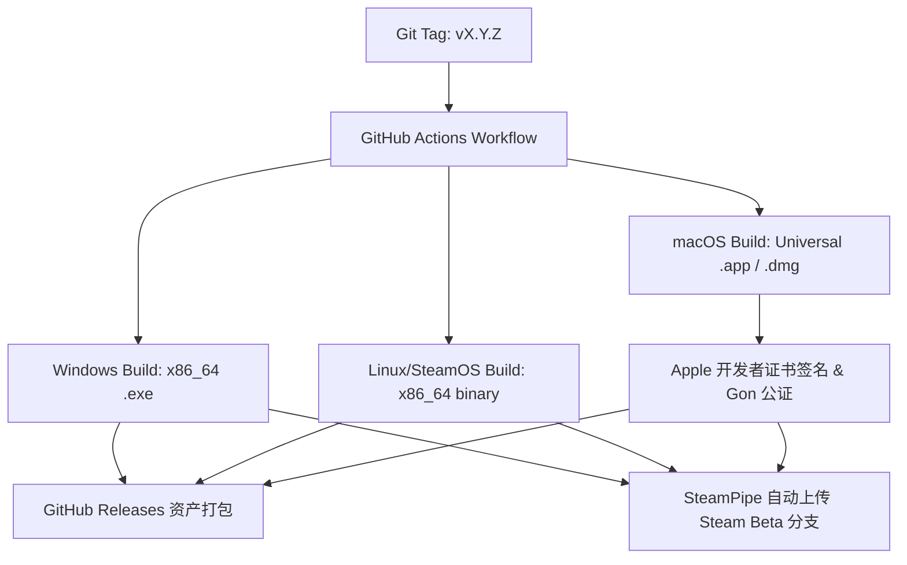

# 《路路捉鬼》技术架构规格书 (Technical Specification)

> **版本**：v1.0.0  
> **制定日期**：2026-10-02  
> **面向平台**：  
> - **第一阶段（桌面端）**：macOS (Apple Silicon & Intel) + Windows (x64) + SteamOS / Linux (Steam Deck Verified)  
> - **第二阶段（移动端）**：iOS + Android  
> **核心引擎**：Godot 4.3+ (2D / Compatibility 模式)  
> **仓库形态**：pnpm + Turborepo 驱动的多包架构 (Monorepo)

---

## 1. 架构目标与设计原则

1. **跨平台零重构**：从第一天起统一视口缩放、输入抽象与渲染后端，确保桌面端（鼠标/手柄）到移动端（触屏）的代码复用率达到 95% 以上。
2. **轻量与高能效**：游戏底层运行于 `gl_compatibility` (OpenGL ES 3.0)，在 Steam Deck 掌机与低端移动设备上兼顾低功耗、低发热与稳定 60 FPS。
3. **数据与逻辑分离（Data-Driven）**：关卡波次、台词剧本、符箓数值、鬼祟属性采用可读可版本化的配置格式，方便持续迭代与自动化校验。
4. **做减法的生产力管线**：围绕“固定机位监控”、“少人形动作”、“鬼影粒子”、“CRT 扫描线/噪点”等核心风格，最大化利用 Godot 原生 2D 节点与 CanvasItem 着色器。

---

## 2. Monorepo 仓库拓扑与工程规范

采用 **pnpm workspaces** 作为顶层包管理器，统管游戏主工程、工具链、静态宣发站点与共享资源。

### 2.1 目录树架构

```text
lulu-zhuogui/
├── .github/
│   └── workflows/
│       ├── build-game-desktop.yml      # 自动化编译导出 Win / Mac / SteamOS
│       ├── lint-and-test.yml           # 代码规范与数据校验
│       └── deploy-website.yml          # 官网与营销页自动化部署
├── apps/
│   ├── game/                           # [核心游戏] Godot 4 工程根目录
│   │   ├── project.godot               # Godot 项目定义
│   │   ├── export_presets.cfg          # 多平台导出预设 (Win, Mac, Linux/SteamOS)
│   │   ├── assets/                     # 导入后的游戏资产 (SpriteFrames, Audio, Fonts, Shaders)
│   │   ├── src/                        # GDScript 源代码
│   │   └── scenes/                     # .tscn 场景文件
│   ├── website/                        # [官网/宣发页] Astro / Vite 静态站 (宣传、Presskit)
│   └── backend/                        # [可选/后期] 匿名埋点收集、云端通告服务
├── packages/
│   ├── gamedata/                       # [共享游戏数据] JSON/YAML 关卡、台词、数值原始文件
│   │   ├── levels/                     # 序章 + 25 关逐关数据源
│   │   ├── talismans/                  # 符箓数值、克制矩阵
│   │   └── dialogues/                  # 老周耳机台词、NPC 对白
│   ├── tools/                          # [开发工具集] Node.js / CLI 脚本
│   │   ├── export-data.ts              # 将 gamedata 转换并同步入 apps/game/assets/data/
│   │   ├── validate-dialogue.ts        # 剧情对白分支校验工具
│   │   └── pack-assets.ts              # 纹理图集与音频规范化检查
│   └── shared-types/                   # TS 类型定义（关卡格式、存档格式等，供工具链复用）
├── design/                             # 游戏策划与设计文稿（当前 v4.2）
├── marketing/                          # 机组开发日志、宣发文案、原画设定素材
├── pnpm-workspace.yaml                 # pnpm 工作空间声明
├── package.json                        # 根 package.json (开发指令统合)
├── turbo.json                          # Turborepo 任务编排
└── README.md
```

### 2.2 工作空间声明与指令 (`package.json`)

```json
{
  "name": "lulu-zhuogui-monorepo",
  "private": true,
  "scripts": {
    "dev:game": "godot --path apps/game",
    "build:data": "pnpm --filter @lulu/tools run export-data",
    "check:data": "pnpm --filter @lulu/tools run validate",
    "dev:web": "pnpm --filter @lulu/website dev",
    "export:desktop": "pnpm --filter @lulu/tools run export:desktop"
  }
}
```

---

## 3. 客户端技术选型与核心配置 (`apps/game`)

### 3.1 引擎与渲染模式

- **Godot 版本**：`Godot 4.3-stable` 或更新版
- **渲染后端**：`gl_compatibility` (OpenGL ES 3.0 / WebGL)
  - **核心考量**：
    - 纯 2D 监控视角，无需 Vulkan 重型 3D 光影计算；
    - Steam Deck 上通过 Linux 原生运行时获得极低瓦数能耗；
    - 对未来 iOS (Metal via GLES3) 和 Android (各种千元机与老旧 GPU) 达到 99%+ 覆盖率；
    - 着色器（CRT 扫描线、监控色差、噪点、符光）表现全平台统一。
- **语言策略**：**GDScript 2.0 (Strict Typing)**
  - 开启 `project.godot` 中的强制类型检查警告（`warning_levels` 开启静态类型提示），获得 IDE 自动补全并避免运行时拼写低级错误。

### 3.2 分辨率与多端视口适配（Monitor Bezel Strategy）

《路路捉鬼》以**民俗事务调度员的“监控台”**为世界观载体，这为多屏适配提供了天然优雅的解法：

```
+-------------------------------------------------------------------------+
|  [监视器外壳 / 调度台边框] (可动态伸缩，显示时间戳/REC/摄像头通道/信号状态)    |
|                                                                         |
|         +-----------------------------------------------------+         |
|         |                                                     |         |
|         |            核心监控画面 (16:9 黄金区域)              |         |
|         |              1920 x 1080 逻辑分辨率                  |         |
|         |                                                     |         |
|         +-----------------------------------------------------+         |
|                                                                         |
+-------------------------------------------------------------------------+
```

| 平台 | 物理分辨率/比例 | 视口处理逻辑 |
| :--- | :--- | :--- |
| **标准桌面 (PC/Mac)** | `1920×1080` (16:9) | 核心监控区 1:1 满屏显示，四周呈现微小工业边框 |
| **Steam Deck (SteamOS)** | `1280×800` (16:10) | 核心 16:9 画面垂直居中；上下多出 80px 扩展为**“监控台物理刻度面板与状态指示灯”**，无黑边违和感 |
| **带带鱼屏/平板** | `4:3` 或 `21:9` | 视口模式设为 `canvas_items` + `expand`，左右扩展调度台工具栏（符纸托盘、老周耳机通讯波形） |
| **未来手机 (iPhone/Android)** | `19.5:9` ~ `20:9` (灵动岛/打孔) | 查询 `DisplayServer.get_display_safe_area()`，将边缘避让区设计为监视器外壳螺丝与天线信号格 |

---

## 4. 客户端系统架构与模块设计

```mermaid
graph TD
    subgraph Core Engine [Autoload 单例层]
        GM[GameManager 状态机]
        AM[AudioManager 音频管理]
        SM[SaveManager 存档/SteamCloud]
        IM[InputManager 统一输入代理]
        Steam[SteamManager Steamworks对接]
    end

    subgraph UI System [界面层 / 监控终端]
        DeskUI[调度室书桌 / 关前选单]
        MonitorFrame[监视器外框 / 通道切换]
        DialogueBox[老周对讲机 / 剧情字幕]
        TalismansTray[底部符箓托盘 & 符力条]
    end

    subgraph Level System [关卡战斗系统]
        LC[LevelController 关卡波次控制器]
        HotspotMgr[HotspotManager 符位插槽管理]
        PathMgr[PathManager 鬼祟巡逻轨迹]
        SpiritMgr[SpiritManager 祟团生成与行为]
        SpellCaster[SpellCaster 五雷法地掷引雷]
    end

    IM --> UI System
    IM --> Level System
    GM --> Level System
    GM --> UI System
    LC --> HotspotMgr
    LC --> SpiritMgr
    SpiritMgr --> PathMgr
```

### 4.1 核心单例服务 (Autoloads)

1. **`GameManager`**：
   - 驱动游戏总体状态：`TITLE` -> `DESK`（接单/准备） -> `LEVEL_INTRO`（侦察逛热点） -> `LEVEL_COMBAT`（守波布防） -> `LEVEL_RESULT`（结算） -> `STORY_INTERLUDE`。
2. **`InputManager` (跨平台输入抹平层)**：
   - 将底层鼠标、手柄、触屏抽象为一套统一信号：
     - `signal pointer_pressed(global_pos: Vector2)`
     - `signal pointer_dragged(global_pos: Vector2)`
     - `signal pointer_released(global_pos: Vector2)`
     - `signal slot_cycle_requested(direction: int)`（专门为手柄方向键切换机位内符位设计）
3. **`SaveManager`**：
   - 基于本地 JSON 加密持久化；
   - 包含分支旗标（如老周关系、小武线选择、布丁誓约信物状态）；
   - 对接 Steam Cloud 同步目录。
4. **`SteamManager`**：
   - 封装 `GodotSteam` GDExtension；
   - 优雅降级：非 Steam 环境运行（开发调试、Mac 打包、未来手机端）时自动进入 Dummy 桩模式，保证代码零 `#ifdef` 分裂。

### 4.2 关卡与塔防战斗子系统

1. **符位系统 (`HotspotSlot`)**：
   - 派生自 `Area2D`。挂载于机位画面内的门缝、窗台、地漏等固定位置。
   - 状态：`EMPTY` -> `OCCUPIED` (已贴符) -> `EXHAUSTED` (符力耗尽消散) -> `KICKED` (被路人踢落预警)。
   - 交互：支持拖拽吸附、点击撕符回收。
2. **鬼祟巡逻系统 (`SpiritActor`)**：
   - 沿 `Path2D` / `PathFollow2D` 驱动移动。
   - 路径动态修饰（驱离符改道）：当检测到前方路段有“驱离符结界”时，动态切换 `PathFollow2D` 的分支曲线（如将善鬼赶往公交后排、将老闵逼入交接区）。
   - 行为树极简：移动、被定神（速度降为 0 并亮起拘留标记）、被雷轰散、被附身宿主吸引。
3. **符力经济系统 (`TalismanEnergy`)**：
   - 机制：基础持续自回（像慢回蓝）为主，掉落碎屑捡拾为辅。
   - 关卡难度旋钮：通过导出配置调节 `base_regen_rate` 与 `drop_rate`。
4. **五雷引雷系统 (`LightningCaster`)**：
   - 玩家在屏幕划线或点击地面，生成 `LightningStrike` 粒子与音效，对落点半径内的阴煞造成瞬间范围爆破。

### 4.3 视觉风格管线 (CRT & 监控后处理)

- **Monitor CRT Shader**：
  - 作为一个全屏 `ColorRect` 挂载在监控画面顶部；
  - 整合功能：微弱行扫描线（Scanlines）、画面边角微小桶形畸变（Curvature）、监控噪点微粒（Grain）、通道时间码（REC 00:23:15）；
  - 性能保障：单 Pass 片元着色器完成，禁止多重 Framebuffer 拷贝。
- **鬼祟渲染风格**：
  - 严格落实**“少人原则”**：
  - 阴煞祟团采用 2D 粒子系统 (`CPUParticles2D`，对移动端/兼容模式更友好) + 动态黑烟 Shader；
  - 偶尔出现的活人只提供远景静态剪影或简易步行 SpriteFrames，无骨骼动画消耗。

---

## 5. 跨平台输入与控制方案规范

### 5.1 操作映射矩阵

| 操作动作 | **桌面 (PC / Mac)** | **Steam Deck (SteamOS)** | **移动端 (iOS / Android)** |
| :--- | :--- | :--- | :--- |
| **选择/贴符** | 鼠标左键拖拽 | 右触控板模拟鼠标 / 触屏拖拽 | 单指触控拖拽 |
| **撕符** | 鼠标右键单击 / 悬停长按 | 手柄 X 键 / 触屏长按 | 快速长按或滑出 |
| **五雷引雷** | 鼠标选中快捷位地面点击 | 手柄 RT 扳机 + 摇杆指引 / 触控板直接敲击 | 手指直接点触地面 |
| **符位快速循环** | Tab 键 / 滚轮 | 手柄十字键 (D-Pad) / LB RB | 点击屏幕目标插槽 |
| **监控切路 (第5关等)** | 键盘数字键 1~4 / 画面 UI 按钮 | 手柄 Y 键 / 切换按钮 | 点击监视器角落下标 |
| **召唤阴差** | 点击 UI 高亮按钮 | 手柄 A 键（目标被定神后高亮） | 点击浮起印章按钮 |

### 5.2 Steam Deck 针对性优化

1. 默认开箱即用支持 **Steam Input**，提供官方推荐布局（Gamepad with Mouse Trackpad）；
2. 文本字体物理高度在 1280×800 屏幕上至少保持 **24px 逻辑像素以上**，支持中文字幕大小档位调节（标准/大字号）；
3. 完美处理 Steam Deck 掌机**电源键休眠/唤醒**：在 `MainLoop.NOTIFICATION_APPLICATION_PAUSED` 与 `RESUMED` 时自动暂停关卡，防止睡眠期间音频断音或后台逻辑空跑。

---

## 6. 数据管线与内容生产 (Data Pipeline)

```mermaid
graph LR
    subgraph Data Source [策划编辑层 (packages/gamedata)]
        A1[01_levels.json / yaml]
        A2[talismans_meta.json]
        A3[dialogues_twine.json]
    end

    subgraph Tooling [转换与校验 (packages/tools)]
        B1[export-data.ts]
        B2[Schema Validator]
    end

    subgraph Godot Game [游戏导入区 (apps/game/assets/data/)]
        C1[levels.tres / json]
        C2[dialogues.tres / json]
    end

    A1 & A2 & A3 --> B2 --> B1 --> C1 & C2
```

1. **源格式**：策划数据（关卡时间轴、符力自回速度、敌人波次、老周耳机台词）存放在 `packages/gamedata/` 下的 JSON / YAML 文件中，使用 VSCode 配合 JSON Schema 即可编辑和提示。
2. **构建脚本**：通过 `pnpm build:data` 触发 `packages/tools/export-data.ts`，自动校验合法性（如检查关卡引用的符位 ID 是否真实存在），并同步到 `apps/game/assets/data/` 目录供 Godot 运行时直接加载。

---

## 7. CI/CD 与多平台发布流水线

利用 GitHub Actions 建立自动化流水线，代码推送到 `main` 或打 Tag 时全自动编译并输出构建工件。



### 平台发布 Checklist：
- [ ] **Windows**：构建单一 `.exe` + `.pck`，集成 Steamworks 运行环境；
- [ ] **macOS**：
  - 生成包含 `x86_64` 和 `arm64` 的 Universal 二进制包；
  - 集成 Apple 开发者证书签名与 Notarization 脚本（避免 macOS 提示“无法打开，因为无法验证开发者”）；
- [ ] **Linux / SteamOS**：
  - 编译输出原生 Linux 二进制；
  - 确认 glibc 最低兼容基线（在 Ubuntu 20.04/22.04 容器中编译，确保完美运行于 SteamOS 3.x）；
- [ ] **(未来) 移动端**：
  - Android：一键输出 Signed Release `.aab` 与 `.apk`；
  - iOS：导出 Xcode Project 并走 Fastlane 自动打包发布 TestFlight。

---

## 8. 开发路线图与里程碑 (Milestones)

| 阶段 | 周期目标 | 核心交付物 |
| :--- | :--- | :--- |
| **M1: 极简原型 (Greybox Prototype)** | 2 周 | 完成第 1 关电梯场景：单机位 45° 俯视、门下缝贴符、符力自回、鬼影进门、老周劝退结算。验证 Godot 2D 与手感。 |
| **M2: 机制与输入闭环 (Vertical Slice)** | 4 周 | 完成 1~5 关（包含第 4 关驱离符改道、第 5 关定神+阴差拘魂、手操引雷）；支持鼠标、键盘、Steam Deck 手柄无缝操作。 |
| **M3: Steam 试玩版 (Steam Demo / Early Access)** | 6 周 | 接入 GodotSteam（成就、云存档）；适配 1280×800 掌机比例；通过 macOS 签名公证；上线 Steam 愿望单/Demo。 |
| **M4: 完整主线 (Full Release)** | 8 周 | 序章 + 25 关逐关内容交付；布丁誓约叙事弧闭环；完整音效与方言配音集成；多结局分支判定系统。 |
| **M5: 移动端移植 (Mobile Rollout)** | 3 周 | 开启触摸安全区（Safe Area）适配；接入 App Store / Google Play / TapTap SDK；性能调优。 |

---

## 9. 结论

本架构方案完全满足：
1. **统一性**：Monorepo 集中管理游戏、工具与数据；
2. **轻量性**：Godot 4 兼容模式为 2D 监控叙事塔防量身定制；
3. **跨平台性**：一步到位直达 macOS + Windows + Steam Deck，同时无缝铺平未来通往 iOS 与 Android 的迁移之路。
